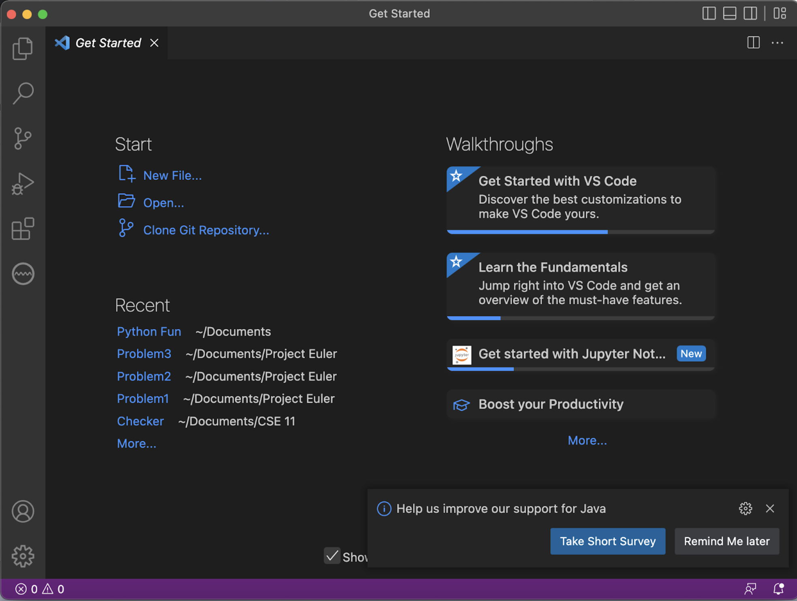
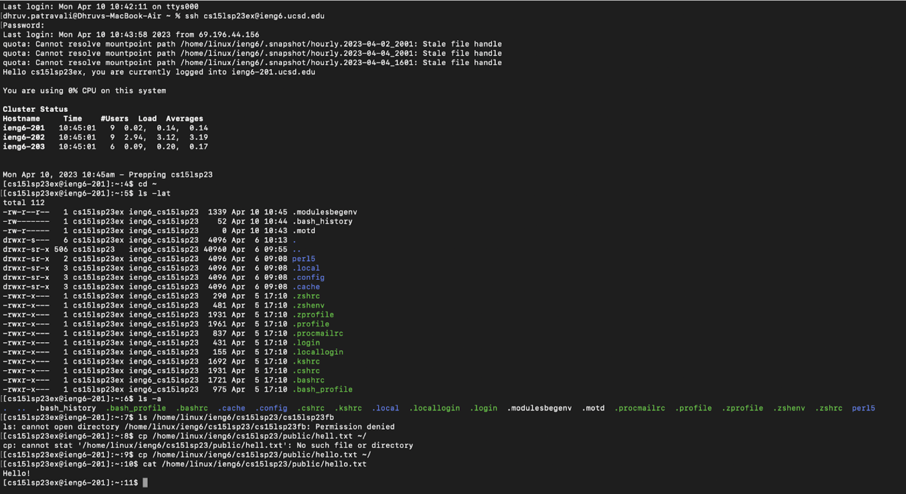

# CSE 15L Lab Report 1
## 4/10/2023
**Step 1**: Install Visual Studio Code onto your computer. Go to the VSCode download page: [Link]https://code.visualstudio.com/Download. Depending on whichever operating system your computer uses, use the respective provided option to download VSCode onto your computer. 

**Step 2**: Remotely connect to the provided server through your course specific CSE15L account. First, make sure that you have a way to use the Command-line Interface. If you are using a Mac, you can just use Terminal. If you are on Windows, download Git Bash, and access the terminal thorugh the VSCode application that you downloaded earlier. Once you have access to the Command-line, use the command 'ssh cs15lsp23zz@ieng6.ucsd.edu' except rather than 'zz', use your individual account numbers from your course specific CSE15L account.

**Step3**: Run some commands. Once you have remote access to the server, practice using some of the commands you learned in class to carry out certain tasks like listing the contents of your current directory, changing your directory, and accessing the contacts of your peers direcories using their individual course specific CSE15L account through the server. 

