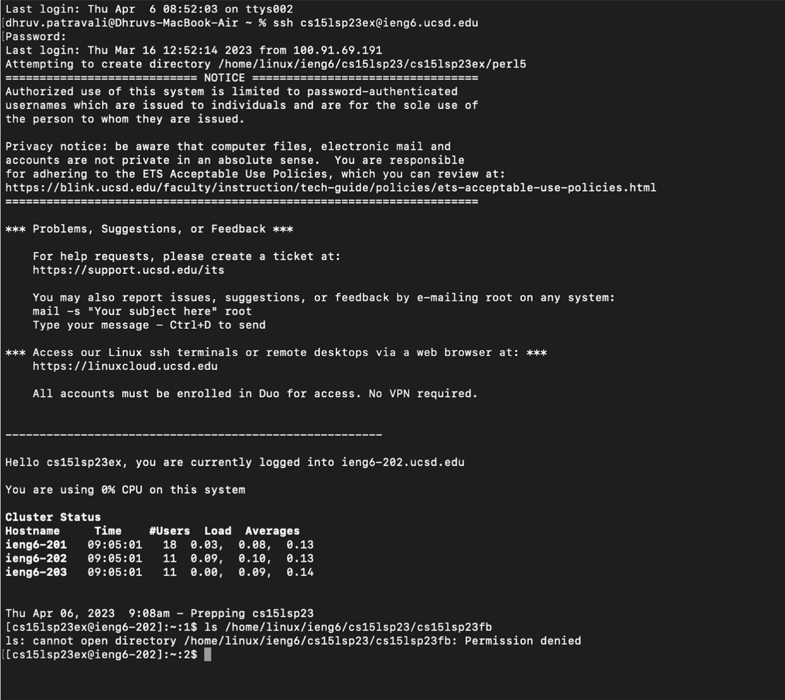

# Lab Report 1
## 4/10/2023
**Step 1**: Install Visual Studio Code onto your computer. Go to the VSCode download page: [Link](https://code.visualstudio.com/Download). There will be several download options, which are dependent on which operating system your computer runs on. My computer is a mac, so I used the mac download option to install Visual Studio Code. 

**Step 2**: Remotely connect to the provided server through your course specific CSE15L account. First, make sure that you have a way to use the Command-line Interface. If you are using a Mac, you can just use the Terminal application. If you are on Windows, download Git Bash, and access the terminal thorugh the VSCode application that you downloaded earlier. Once you have access to the Command-line, use the command 'ssh cs15lsp23zz@ieng6.ucsd.edu' except rather than 'zz', use your individual account numbers from your course specific CSE15L account. Enter your account password when prompted to, and you should gain access to the server.

**Step3**: Run some commands. Once you have remote access to the server, practice using some of the commands you learned in class to carry out certain tasks like listing the contents of your current directory, changing your current directory, and accessing the contacts of your peers directories throughy the server (by using their individual course specific CSE15L account details).

## Revision: Adding Descriptions of Commands shown in the Above Screenshot (relevant commands indicated by yellow dots)
pwd: prints the working directory (reveals the path of the current directory). As seen at the top of the screenshot, the working directory was /home/linux/ieng6/cs15lsp23/cs15lsp23ex

ls: lists the contents of the current directory, which was a file (hello.txt) and two directories (per15 and wavelet)

cd wavelet: changes the working directory to wavelet

cd ~ : returns to the home directory from wavelet

mkdir testDirectory: creates a new directory within the working directory and names it "testDirectory"

ls -lat : combines the commands ls -l, ls -a, and ls -t. "ls -l" displays the mode, number of links, owner, group, size, and time of last modification for each file. "ls-a" displays all files in the current directory including files that begin with "." and all the files in every subdirectory of the working directory. "ls -t" sorts each file by the modification time from latest to oldest modification time.

ls -a : prints all the files in the current directory including files that begin with "." and all the files in every subdirectory of the working directory

ls /home/linux/ieng6/cs15lsp23/cs15lsp23fb: lists the contents of another student's remote server home directory. Permission was denied.

cp /home/linux/ieng6/cs15lsp23/public/hello.txt ~/ copies the file hello.txt (shown by its absolute path) to the home directory

cat /home/linux/ieng6/cs15lsp23/public/hello.txt: prints the contents of the file hello.txt (the absolute path for the file was used)
