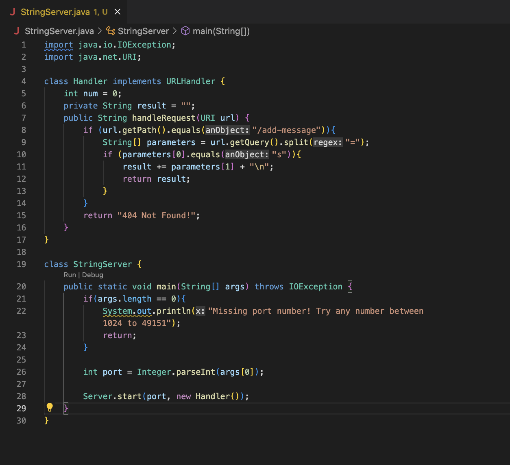

# Lab Report 2
## 4/24/2023

## Part 1
Code for StringServer:

Terminal Commands for running StringServer with port number 5000:

**First Request: "Hello"**

**Methods called:**

      Integer.parseInt(args[0]) 
- used to process the integer from the terminal to create a new server with the specified port number

      Server.start(port, new Handler()
- used to start the server given the port number and the handler

      handleRequest(URI Url)
- took the server's URI link to carry out certain operations depending on the contents of the URI

      url.getPath()
- used to get the "path" portion of the URL (the part after the "/" character)

      .equals("/add-message")
- used to compare the URL path to the string "/add-message"

      url.getQuery()
- used to get the "query" portion of the URL (the part after the "?" character)

      .split("=")
- splits the query into two two values (one from either side of the "=" provided as the parameter). This is so that we can isolate the String that we want to print to the webpage

**Relevant arguments:**

      http://localhost5000
- URI argument passed to handleRequest which is just the URL for the server that I created

      "/add-message"
- String argument that gets compared to the path of the URL to decide whether to extract the string that follows the query

      "="
- String argument passed to the split method that splits the query into two String values that get stored to an array. This is so that we can isolate the value of String s in the query to display it on the webpage

      "s"
- String argument passed to an equals method to ensure that we only deal with a substring that is declared to be String s in the query

      String args[]
- Array argument passed to the main method in the terminal. Important for our purposes because this array will contain the port number.

      args[0]
- The element of the args array that contains the port number

      5000
- The value of the port number that gets passed to te Server.start method to create the server

**Values of relevent fields:**

      private String result
- Starts as ""

**Changes in relevent fields values (for this specific request):**

      private String result
- Ends up as "Hello" once we carry out the request, as the String s that we took from the query was "Hello"   

**Second Request: "Hello \n How are you"**

**Methods called (Same methods called as in the first request):**

      Integer.parseInt(args[0])
- used to process the integer from the terminal to create a new server with the specified port number

      Server.start(port, new Handler()
- used to start the server given the port number and the handler

      handleRequest(URI Url)
- took the server's URI link to carry out certain operations depending on the contents of the URI

      url.getPath()
- used to get the "path" portion of the URL (the part after the "/" character)

      .equals("/add-message")
- used to compare the URL path to the string "/add-message"

      url.getQuery()
- used to get the "query" portion of the URL (the part after the "?" character)

      .split("=")
- splits the query into two two values (one from either side of the "=" provided as the parameter). This is so that we can isolate the String that we want to print to the webpage

**Relevant arguments (Same relevant arguments as in the first request):**

      http://localhost5000
- URI argument passed to handleRequest which is just the URL for the server that I created

      "/add-message"
- String argument that gets compared to the path of the URL to decide whether to extract the string that follows the query

      "="
- String argument passed to the split method that splits the query into two String values that get stored to an array. This is so that we can isolate the value of String s in the query to display it on the webpage

      "s"
- String argument passed to an equals method to ensure that we only deal with a substring that is declared to be String s in the query

      String args[]
- Array argument passed to the main method in the terminal. Important for our purposes because this array will contain the port number.

      args[0]
- the element of the args array that contains the port number

      5000
- the value of the port number that gets passed to te Server.start method to create the server

**Values of relevant fields:**

      private String result
- When we run this new request, result starts as "Hello" due to the previous request

**Changes in relevant fields values (for this specific request):**

      private String result
- Ends up as "Hello \n How are you" once we carry out the new request. This displays "Hello" and "How are you" in two separate lines on the webpage. This change is important to note because it shows the important of concatenating the new value of s to result, because it still retains track of the previous value of s from the first request. This would not be the case if we just reassigned the value of result to the new value of s.

## Part 2
**Bug chosen:** Problem in the 'reversed' method of ArrayExamples.java

**Failure-Inducing Input:** {1, 2, 3, 4, 5}

      int[] input2 = {1, 2, 3, 4, 5};
      assertArrayEquals(new int[]{5, 4, 3, 2, 1}, ArrayExamples.reversed(input2));
^ The above Junit test compared an array {5, 4, 3, 2, 1} which was the expected value of the reversed array, to the actual reversed array, and the test returned false

**Input that doesn't induce a failure:** { }  (an empty array)

      int[] input1 = { };
      assertArrayEquals(new int[]{ }, ArrayExamples.reversed(input1));
^ The above Junit test compared an empty array (the expected output) to the reversed input1 (another empty array), and the test returned true

**Symptom**: Below you can see that the Junit test passed for the test case that used the non-failure-inducing input (empty String), but flagged an error in the test case that tried to compare the expected output {5, 4, 3, 2, 1}, to the actual output. The error message shows that in the first index, where the tester expected an output value of 5, it actually got the value 0 in the actual output. 

**The bug (Before and After):**

Before:

      static int[] reversed(int[] arr) {
         int[] newArray = new int[arr.length];
         for(int i = 0; i < arr.length; i += 1) {
            arr[i] = newArray[arr.length - i - 1];
         }
         return arr;
      }
      
After:

      static int[] reversed(int[] arr) {
         int[] newArray = new int[arr.length];
         for(int i = 0; i < arr.length; i += 1) {
            newArray[i] = arr[arr.length - i - 1];
         }
         return newArray;
      }
  
**The fix:** The issue was that in the old code, instead of iterating through the contents of the array and saving the reversed contents of the argument into a new array and returning it, they created a new empty array and saved the reversed contents of the new, empty array into the array that was passed as the argument to be reversed. Then they returned the array from the argument, which was then simply full of zeroes. My fix was to save the reversed elements of the old array into the new array I created, and then return the new array, which after the loop should contain the reversed contents of the array that was passed in the argument.

## Part 3
My favorite thing that I learned in the last two weeks of lab was how to create my own local server and handle the URLs that coorelate to the servers I made. Splitting up parts of the URL's and using them to carry out certain operations that are dependent on certain aspects of the paths and queries was very intersting to me, and I can't wait to see how I might apply these skills to working on servers that aren't just local. 

