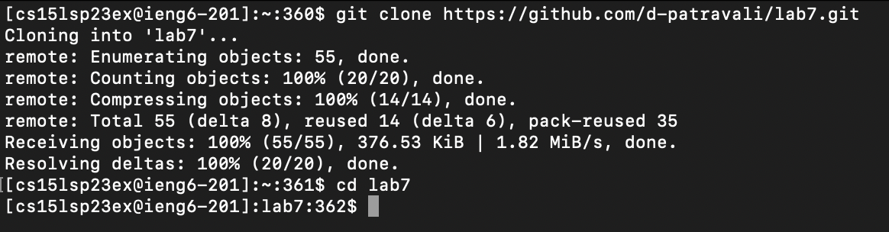
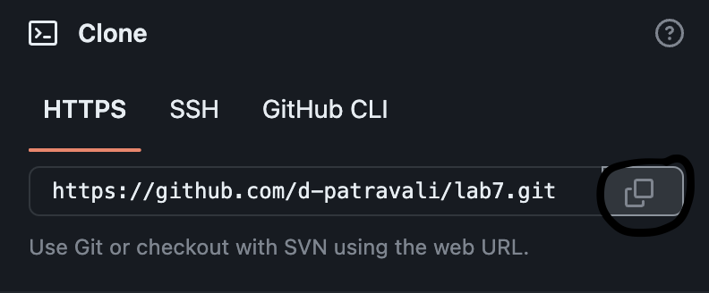
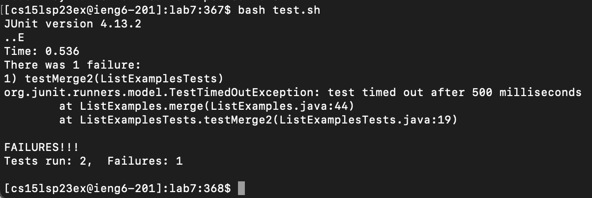
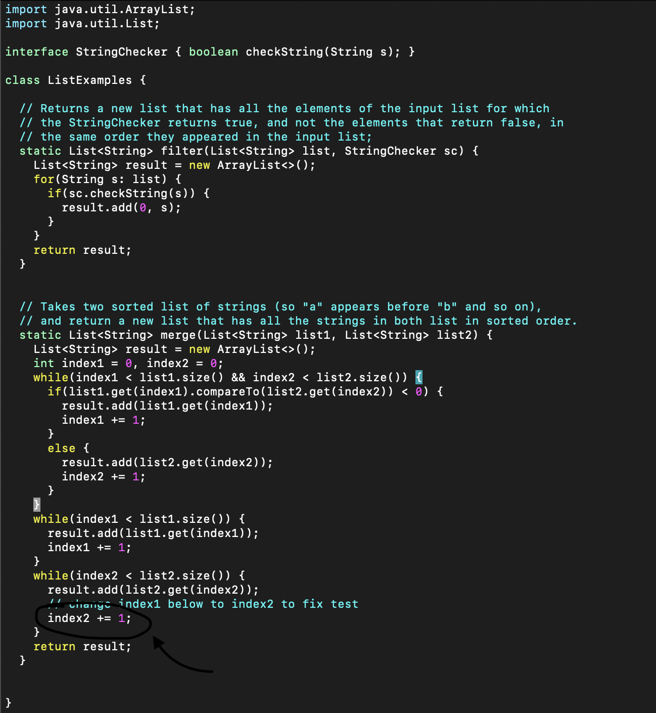
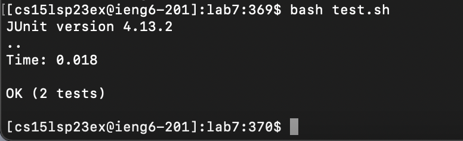
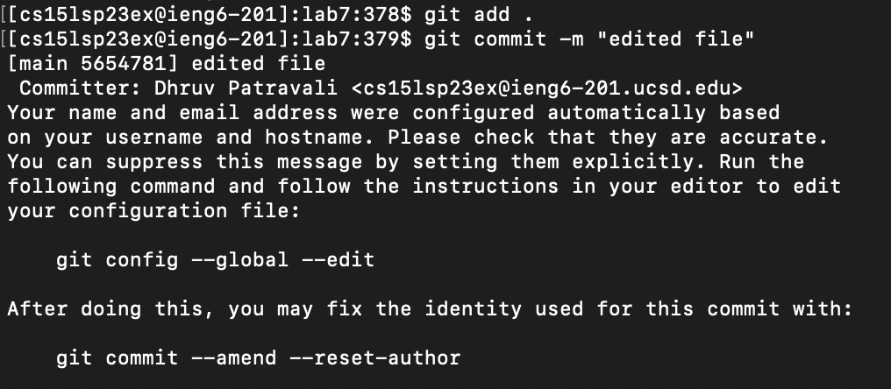

# Lab Report 4
## 5/22/2023

## Step 4: Log into ieng6

For this step, I used the following command to remotely connect to the ieng6 serve with my personalized account. (Note that the star keys represent my password characters):
    
    ssh cs15lsp23ex@ieng6.ucsd.edu <return>
    Password: *********** <enter>

## Step 5: Clone my fork of the lab7 directory

For this step, I first clicked the copy button (shown in a screenshot below) at the top right of the gitHub repository page to copy the HTTPS link of the repository to my clipboard. I chose the HTTPS link rather than an SSH key because it was accessible with a single button click, and it was a way to improve the time of my speedrun. Then I used the following commands in terminal to clone the lab7 directory, which I had previously forked in github. This created a new version of the lab7 directory in my ieng6 account. Then I changed directories to the new lab7 directory with `cd`.

     git clone <command-V>
     <return>
     cd lab7
     
The `<command-V>` keypress pasted the HTTPS link into my terminal. The link was: `https://github.com/d-patravali/lab7.git`.

## Step 6: Run the tests, demonstrating that they fail

For this step, as shown in the code block below, I used a compile and run command specific to JUnit to run the required tests. Considering there are unreasonably long commands with complex characters, I used the provided bash script in `test.sh` to run these commands. We can use this bash script directly because it is in the lab7 directory. The key presses for running this code is shown below.

    bash test.sh <return>

## Step 7: Edit the code file ListExamples.java to fix the failing test

In this part of step 7, I used the following command to open the ListExamples.java file in the built-in vim text editor.
   
    vim ListExamples.java

Then I editted the `ListExamplex.java` file using the commands shown below. The screenshot shows what the changed code looked like.

Here is the order of key presses I used to make the correct edit to the file: 
    
    <down> <down> <right> <right> <e> <right> <i> <delete> <2> <esc> <:wq>

  - The `<down>` command moves the cursor down in normal mode
  - The `<right>` command moves the cursor right in normal mode
  - The `<e>` command moves the cursor to the end of the current word in normal mode
  - The `<i>` command switches from normal to insert mode allowing me to edit the file
  - The `<delete>` and `<2>` were just keys that I types to edit the file like a regular document or text file in any other text editor
  - The `<esc>` command swithces back from insert to normal mode
  - The `<:wq>` command saves the changes to the java file and exits vim
  *Need a screenshot of my commands, just didn't finish yet*

### Step 8: Run the tests, demonstrating that they now succeed

After correcting the `ListExamples.java` file, I re-ran the JUnit tests by using the `test.sh` bash script once again. `OK (2 Tests)` was printed to the terminal which showed that the tests were now succesful. Below is the command and key presses to run the tests.

    bash test.sh <return>

### Step 9: Commit and push the resulting change to your Github account

In order to commit and push the resulting changes to my Github account, I used the following commands and key presses:

     git add . <return>
     git commit -m "edited file" <return>
     git push <return>
     
My changes were successfully pushed to Github!
