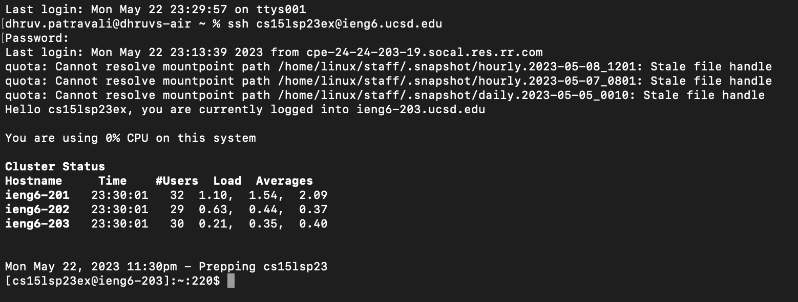
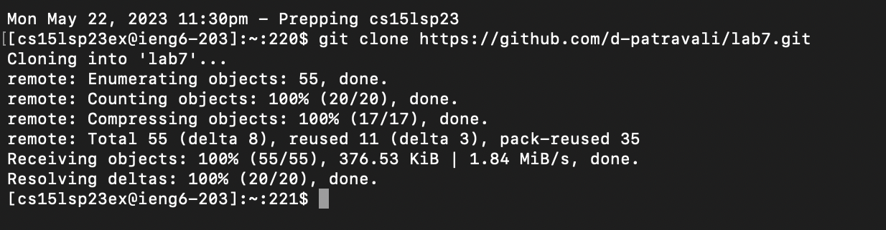

# Lab Report 4
## 5/22/2023

### Step 4: Log into ieng6

For this step, I used the following command to remotely connect to the ieng6 serve with my personalized account:
    
    ssh cs15lsp23ex@ieng6.ucsd.edu

### Step 5: Clone my fork of the lab7 directory

For this step, I used the following command in terminal to clone the lab7 directory, which I had previously forked in github. This created a new version of the lab7 directory in my ieng6 account.

     git clone https://github.com/d-patravali/lab7.git

### Step 6: Run the tests, demonstrating that they fail
Do not know how to do this step: when I write `javac ListExamples.java` the code compiles and file seems to work, how do I show that it doesn't? It says I can't run it with the `java ListExamples` command because there is no main method, which doesn't change once I make the correction in step 7.

### Step 7: Edit the code file ListExamples.java to fix the failing test

In this part of step 7, I used the `vim ListExamples.java` command to open the ListExamples.java file in the built-in vim text editor.
Order of Commands Used: `<down> <down> <right> <right> <e> <right> <i> <delete> <2> <esc> <:wq>`
  - The `<down>` command moves the cursor down in normal mode
  - The `<right>` command moves the cursor right in normal mode
  - The `<e>` command moves the cursor to the end of the current word in normal mode
  - The `<i>` command switches from normal to insert mode allowing me to edit the file
  - The `<delete>` and `<2>` were just keys that I types to edit the file like a regular document or text file in any other text editor
  - The `<esc>` command swithces back from insert to normal mode
  - The `<:wq>` command saves the changes to the java file and exits vim
  *Need a screenshot of my commands, just didn't finish yet*

### Step 8: Run the tests, demonstrating that they now succeed
Similar to Step 6 issue: how do I show that it works now if I can't run it with `java ListExamples`?

### Step 9: Commit and push the resulting change to your Github account
Did not finish, would just like feeback on whatever parts I was able to answer.
