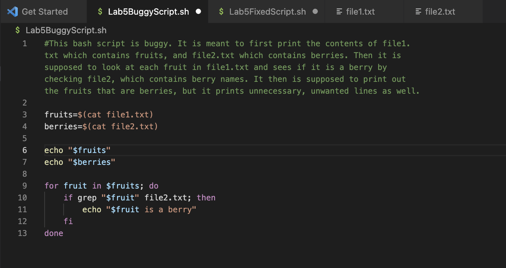
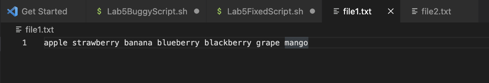
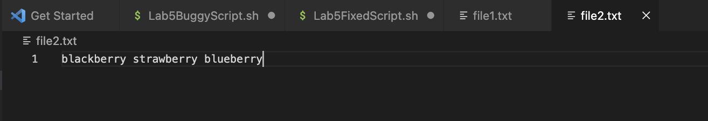
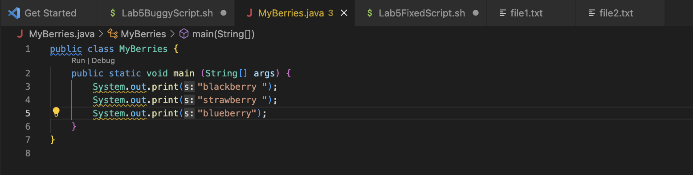
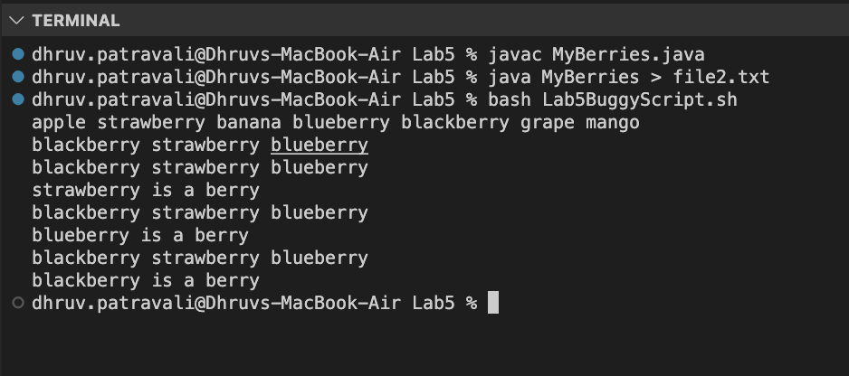
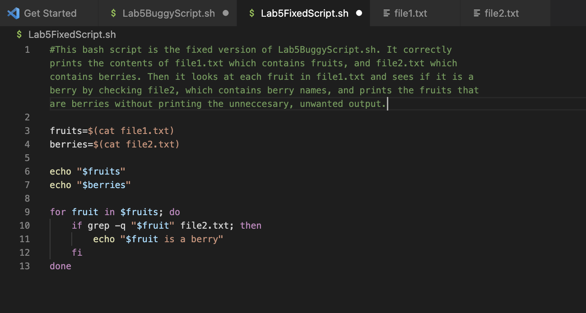
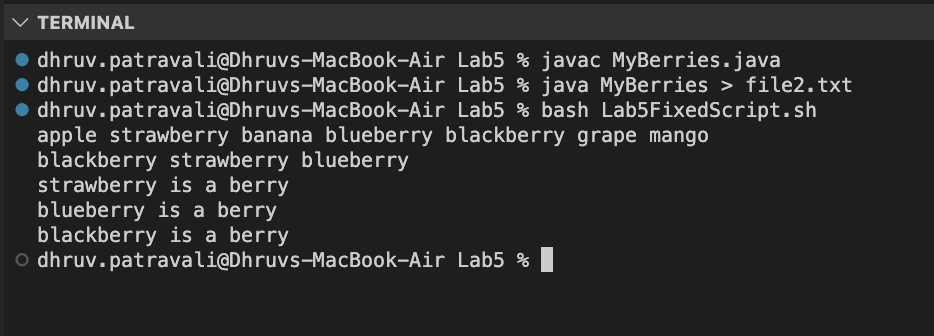

# Lab Report 5
## 6/05/2023
## Part 1 - Debugging Scenario
### New Question
### Title: Trouble debugging an error in my Bash Script
### Category: Debugging
**What environment are you using (computer, operating system, web browser, terminal/editor, and so on)?**

I am using a Mac (OS operating system), and I am editing my Bash Script with VSCode. I am also using VSCode's terminal to run my commands and Bash Script.

**Detail the symptom you're seeing. Be specific; include both what you're seeing and what you expected to see instead. Screenshots are great, copy-pasted terminal output is also great. Avoid saying “it doesn't work”.**

The symptom is that when I run the bash script, it works mostly as intended except for the fact that it prints unwanted output as well. 
First, I run a simple pair of commands, `javac MyBerries.java`, paired with `java MyBerries > file2.txt` to take the print output of the java file and save that output into `file2.txt`. This output will be names of different berries. Then I run my Bash Script, `Lab5BuggyScript.sh`, which initially prints the contents of both text files (`file1.txt and file2.txt`) to the console. The Bash Script should iterate through each word in `file1.txt`, which contains several names of fruits. For each fruit that the script looks at in `file1.txt`, it checks to see if that fruit exists in `file2.txt`, which specifically contains berries from the java file. This is meant to check whether the fruit that is being looked at in `file1.txt` is in fact a berry; if it is, the script is supposed to print `"$fruit is a berry"`, where `$fruit` is a variable that references the fruit from `file1.txt` that is being looked at in the current for loop iteration. More specifically, the *symptom is that for each iteration of the for loop that is included in my Bash Script, on top of the expected output, the script prints the output of `grep "$fruit" file2.txt`, which prints the full line on which the word was found from `file2.txt`*. I want to omit this `grep` output, and only print the intended output of `$fruit is a berry`. How can I do this, considering I cannot get rid of the 
]grep command, as I need it to search for the desired word in `file2.txt`. Below are screenshots of my faulty Bash Script: `Lab5BuggyScript.sh`, `file1.txt`, `file2.txt` (after populating it with the right contents from the java file), and my java file: `MyBerries.java`. Lastly, I have attached a screenshot of the faulty output that is produced when I run this Bash Script in terminal.

**Detail the failure-inducing input and context. That might mean any or all of the command you're running, a test case, command-line arguments, working directory, even the last few commands you ran. Do your best to provide as much context as you can.**

The failure inducing input in this case is not a value or argument that highlights a fault in the program; rather, it is a command that generates unexpected behavior (unwanted output to the terminal): `grep "$fruit" file2.txt`. The issue is that this command, which I need to use in order to carry out my desired operation of searching for a specified String in `file2.txt`, has an output itself; it prints the contents of the line(s) of `file2.txt` on which the String was found (only when it is found).

## TA Response
Hello, thank you for your question. I have a suggestion regarding your issue that might ensure that you can omit the unwanted output that you are experiencing. As you explained, the `grep` command does print the contents of the line on which the specified String is found in the specified file. However, there is a grep modifier that can fix your issue. Rather than using `grep` on its own, try using `grep -q`. The `-q` modifier is the *quiet* modifier, which will return the exit status of the command without producing the normal output. This means that for your purposes, by using this modifier, the `grep` command will still accomplish its task of searching for your specified string in `file2.txt`, but it will *not* produce the unwanted output that you are trying to get rid of in your terminal. Hope this helps.

## Student Trying the TA Advice
Thank you for your response, I tried using `grep -q` rather than just `grep` and got my desired output. It is now clear that *the bug was that I was not using the correct grep command modifier to produce my desired output from the Bash Script*, and using `grep -q` in this situation fixed the bug, ensuring that my program ran as expected and produced the correct output in the terminal. Below are screenshots of my edited Bash Script (a new file called `Lab5FixedScript.sh`) as well as the terminal output that corresponds to it. 

## Information needed about the setup

- File and directory setup needed: For my Bash Script to work,`file1.txt`, `file2.txt`, my java file, `MyBerries.java`, and my corrected Bash Script, `Lab5FixedScript.sh` all need to be in the same directory. This is because I used the relative paths of the text files in my Bash Script, so they must be included in the same directory. This directory also MUST be the working directory when I run the Bash Script for the correct files to be accessed. 
- Contents of the Bash Script file before fixing the bug (no other file needed to be edited): 
- Full command line commands I ran to trigger the bug (Note: did not need to navigate to the correct working directory, because in VSCode I was working in the correct directory already, but opening that directory as my project.):
    
      javac MyBerries.java
      java MyBerries > file2.txt
      bash Lab5BuggyScript.sh

- A description of what to edit to fix the bug: The fix that was required was using `grep -q` instead of `grep`, as the `-q` modifier silenced the unwanted output in the terminal. 

## Part 2 - Reflection

The most interesting thing that I learned in the second half of this quarter was how write Bash Scripts to debug and point out errors in code. This was something that we focused on heavily in Lab 6 in particular, and it was meant to emulate the way that the autograder debugs and grades out code. This was exciting because it showed us how to analyze and manipulate the code that we write in order to make sure that it satisfied our requirements, and as someone who is interested in being a TA for the CSE department in the future, it is a very useful and interesting skill to learn. 

